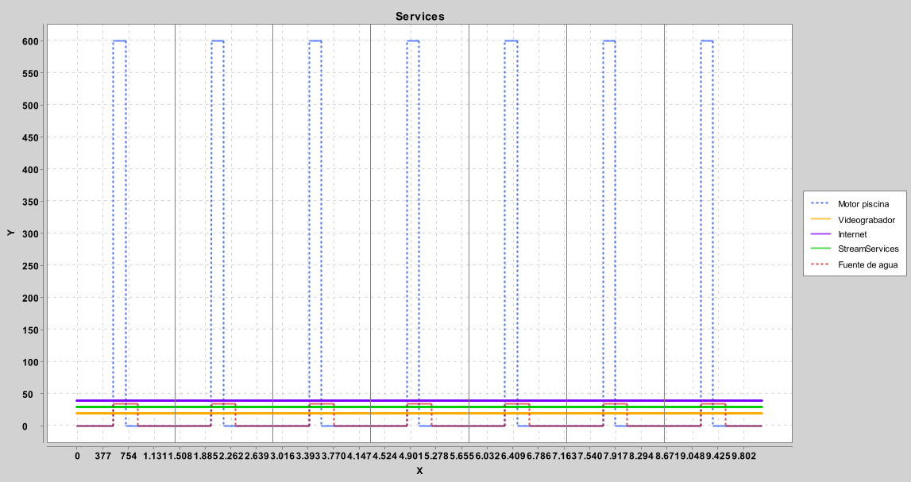
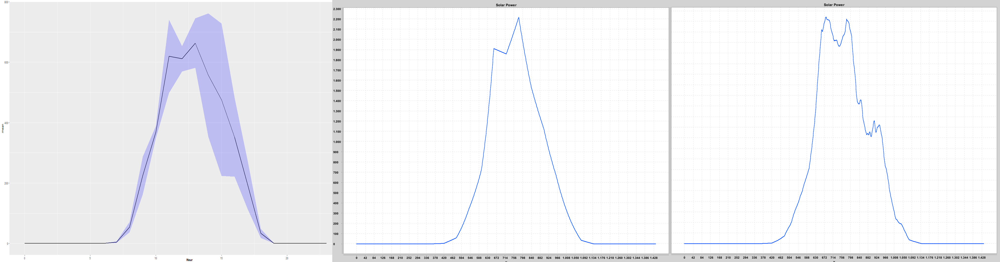

# Table of contents
- [Getting Started](#getting-started)
  * [Run simulator](#run-simulator)
  * [Configuration of the simulation environment via XML](#configuration-of-the-simulation-environment-via-xml)
  * [Configuration of services via XML](#configuration-of-services-via-xml)
  * [Procedural data models](#procedural-data-models)
  * [Energy management algorithm](#energy-management-algorithm)
  * [Service control algorithm](#service-control-algorithm)
  * [Extension points](#extension-points)
  
# Getting Started 
In the following subsections we will explain how to launch the simulator and how to configure/extend each component.


## Run simulator
Import the project into Eclipse and run the main class App.java.

The App.java sample code shows the required components to be instantiated (configuration object and simulation object), along with the necessary configurations.


```Java
Config config = new Config("./data/config.xml");
...
config.setGrid(new BasicGrid("./data/Models/EnergyPrices.csv", seed));
...
List<PowerProducer> powerProducer = config.getPowerProducer();
SimulatedPhotovoltaicModule PVi = new SimulatedPhotovoltaicModule(3.2, seed);
PVi.readFrom1hCSV("./data/Models/SolarRadiationSumary.csv");
powerProducer.add(PVi);
...
List<ElectricalLoad> powerDemand = config.getPowerDemand();
List<Service> servicesList = config.loadServices("./data/services.xml");
ServicesActiveLoad AL = new ServicesActiveLoad(servicesList);
powerDemand.add(AL); // Active load (services)
...
...
// Simulation		
Simulation sm = new Simulation(config);
sm.run();
sm.results();
```


## Configuration of the simulation environment via XML
The simulation environment is configured by using the XML file config.xml, which indicates which energy and service controller will be used, the capacity of the batteries (kW), the number of days to be simulated and whether procedural data generation is activated (including the seed).

In addition, everything related to the simulator log is configured, e.g. generating graphs, saving results in CSV files, displaying statistics in the console, and so on.

Example configuration of the simulator:
```XML
<Config>
	<controller>Method</controller> <!-- Implemented algorithm -->
	<procedural>true</procedural> <!-- boolean, false for repeatability  -->
	<seed>0</seed> <!-- 0: random -->
	<days>7</days> <!-- num days -->
	<battery>4000</battery> <!-- Wh -->
	
	<printResults>false</printResults>
	<printStats>true</printStats>
	<showGraphs>true</showGraphs> <!-- show graphs at the end -->
	<saveGraphs>false</saveGraphs> <!-- save graphs png -->
	<saveResults>false</saveResults> <!-- save csv -->
	<saveResultsOnlyHour>false</saveResultsOnlyHour> <!-- save csv summarized by hours -->
</Config>
```

## Configuration of services via XML
Services are also configured using a XML file services.xml, in which all services are listed together with their properties.

Each service is defined by specifying a name, its power consumption (Wh), its priority, whether it is a smart service (it can be dynamically controlled by the service controller) and the operating range rule.

Operating range rules are used to limit some services to a specific time slot and maximum on-time, for instance, fence lights should only be switched on at night (between 8 pm and 8 am), or the pool pump should only be switched on during the day but for a maximum of three hours, these types of rules allow some services to be switched on at different hours giving the possibility to reduce their energy impact.


XML structure of each service:
```XML
<Services>
	<list>
		....
		<service>
			<name></name>
			<power></power>
			<smart></smart>
			<operatingRange>
				<type></type>
				<min></min>
				<max></max>
			</operatingRange>
			<priority></priority>
			<smartParameters>
				<minTime></minTime>
				<maxTime></maxTime>
				<runTIme></runTime>
			</smartParameters>
		</service>
		....
	</list>
</Services>
```

Table of configured services in the demo code:
| Service            | Smart | Priority | Load   | Rule              |
|--------------------|-------|----------|--------|-------------------|
| Fence lights       | No    | -        | 15 Wh  | 8pm-8am           |
| Facade lights      | No    | -        | 10 Wh  | 8pm-8am           |
| Fridge             | No    | -        | 120 Wh | All time          |
| CCTV DVR           | Yes   | 10       | 20 Wh  | All time          |
| Internet           | Yes   | 8        | 40 Wh  | All time          |
| Pool Pump          | Yes   | 4        | 600 Wh | 9am-5pm (max 3h)  |
| Streaming Services | Yes   | 2        | 30 Wh  | All time          |
| Fountain           | Yes   | 1        | 35 Wh  | 9am-3pm           |




Example of a configuration file for the previous services:
```XML
<Services>
	<list>
		<service>
			<name>Fence lights</name>
			<power>15.0</power>
			<smart>false</smart>
			<operatingRange>
				<type>2</type>
				<min>480</min>
				<max>1200</max>
			</operatingRange>
		</service>
		<service>
			<name>Facade lights</name>
			<power>10.0</power>
			<smart>false</smart>
			<operatingRange>
				<type>2</type>
				<min>480</min>
				<max>1200</max>
			</operatingRange>
		</service>
		<service>
			<name>Fridge</name>
			<power>120.0</power>
			<smart>false</smart>
		</service>
		
		<service>
			<name>Pool Pump</name>
			<power>600.0</power>
			<smart>true</smart>
			<priority>4</priority>
			<smartParameters>
				<minTime>540</minTime>
				<maxTime>1020</maxTime>
				<runTime>180</runTime>
			</smartParameters>
		</service>
		<service>
			<name>CCTV DVR</name>
			<power>20.0</power>
			<smart>true</smart>
			<priority>10</priority>
		</service>
		<service>
			<name>Internet</name>
			<power>40.0</power>
			<smart>true</smart>
			<priority>8</priority>
		</service>
		<service>
			<name>StreamServices</name>
			<power>30</power>
			<smart>true</smart>
			<priority>2</priority>
		</service>
		<service>
			<name>Fountain</name>
			<power>35</power>
			<smart>true</smart>
			<priority>1</priority>
			<smartParameters>
				<minTime>540</minTime>
				<maxTime>900</maxTime>
				<runTime>0</runTime>
			</smartParameters>
		</service>
	</list>
</Services>
```

Table of configured services in the demo code:

## Procedural data models
All the information used by the simulator to determine the solar production and passive energy consumption of the system is based on statistical models modelled using data from a real solar infrastructure.

...
where for each hour the mean value of solar radiation and the upper and lower bound of the 95\% confidence interval are indicated.
The confidence interval is used to procedurally generate each day different but correlated values by using Perlin noise, thus enabling a dynamic and realistic behaviour of the simulations.




## Energy management algorithm

```Java
public abstract class EnergyController {
	public abstract void run(int minute, double powerProduction, double electricalLoad);
```

```Java
public class BasicEnergyController extends EnergyController {
	
	public BasicEnergyController(Battery batteryStorage, Grid gridStorage) {
		super(batteryStorage, gridStorage);
	}

	public void run(int minute, double powerProduction, double electricalLoad) {
		int minuteDay = minute % 1440;
		
		// Determine the energy demand taking into account the energy needed and the energy produced.
		double demandedEnergy = electricalLoad - powerProduction;
		
		// Difference between discharge or charge
		if(demandedEnergy > 0) {
			// If the energy demand is positive, the batteries should be discharged or the grid should be used.
			
			// If the battery can assume the load without being discharged, I use it.
			if(this.batteryStorage.isFeasible(demandedEnergy)) {
				this.batteryStorage.loadWmperMinute(demandedEnergy);
			} else { // Otherwise, I buy from the grid
				this.gridStorage.loadWmperMinute(minuteDay, demandedEnergy);
			}
			
		} if(demandedEnergy < 0) {
			// If the demand is negative it means that there is energy left over and it can be used to charge the batteries or sold to the grid.
			
			// If the battery is not full I charge it
			if(!this.batteryStorage.isFull())
				this.batteryStorage.loadWmperMinute(demandedEnergy);
			else // Otherwise, I sell to the grid
				this.gridStorage.sellWmperMinute(minuteDay, demandedEnergy);
				
		}
		
	}
}
```


## Service control algorithm


```Java
public abstract class ServiceController {
.....
	abstract protected double decision(int minute, Result resultSim);
```

```Java
public class BasicController extends ServiceController {
	public double decision(int minute, Result resultSim) {
		int minuteDay = minute % 1440;
		
		// If there is energy left over I turn services on and if not I turn services off.
		if(resultSim.getBatteryPercentage() >= 100.0 && resultSim.getPowerProduction()-resultSim.getElectricalLoad() > 0)
			this.turnOnFeasible(minute, resultSim);
		else
			this.turnAllOff(minute, resultSim);
		
		
		return 0.0;
	}
	

	protected void turnOnFeasible(int minute, Result resultSim) {
		int minuteDay = minute % 1440;
		double energyAvailable = resultSim.getPowerProduction()-resultSim.getElectricalLoad();
		
		// Browse through the manageable services sorted by priority in order to make decisions.
		for (Service service : this.smartServices) {
			// If the device can be powered
			double serviceLoad = service.getLoad(minute);
			if(energyAvailable > serviceLoad && service.isWorkingTime(minuteDay) && service.checkRunTime(minute)) {
				service.turnOn();
				energyAvailable -= serviceLoad;
			} else {
				service.turnOff();
			}
		}
	}
	
	protected void turnAllOn(int minute, Result resultSim) {
		for (Service service : this.smartServices) {
			service.turnOn();
		}
	}
	
	protected void turnAllOff(int minute, Result resultSim) {
		for (Service service : this.smartServices) {
			service.turnOff();
		}
	}
```

## Extension points
Battery class, ....
