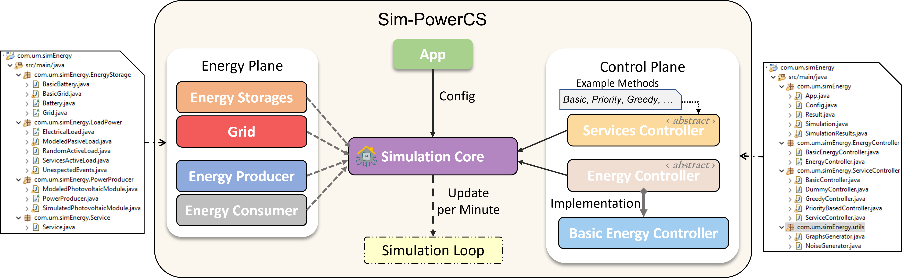
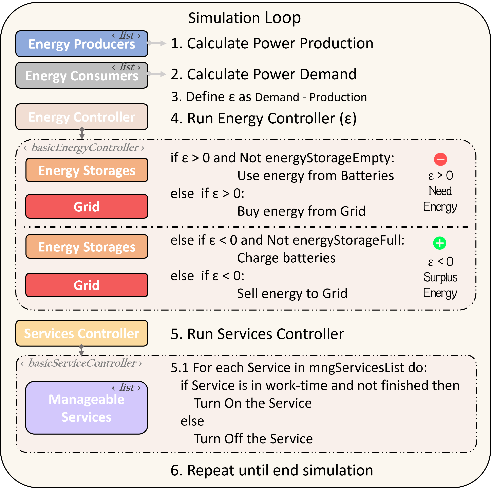
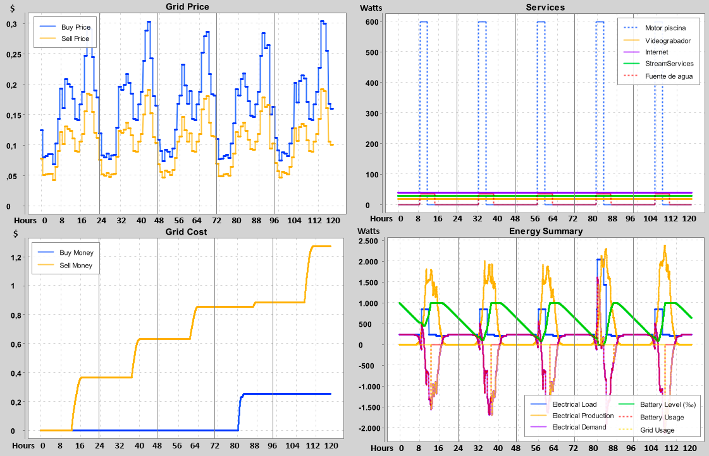

# Sim-PowerCS
Sim-PowerCS: An extensible and simplified open-source energy simulator

Named after Simulator for Power management in Casa ruinaS.

# Citation
To cite, please use the following format: 

# Table of contents
- [Introduction](#introduction)
  - [Requirement](#requirement)
  - [Getting Started](#getting-started)
- [Software description](#software-description)
  - [Software Architecture](#software-architecture)
  - [Software Functionalities](#software-functionalities)
- [Illustrative Examples](#illustrative-examples)
- [Impact](#impact)

# Introduction
In today's world, optimizing energy consumption is critical to combat climate change and natural resource depletion. Smart control of building and home devices is a promising approach to achieving this goal, but due to the difficulties of testing in real environments it is necessary to rely on simulators for a comprehensive evaluation of algorithms in a realistic simulated context at a low cost. In this paper we present a Java-based simulator that allows users to define energy sources and services, test different algorithms, run procedural simulations, and independently optimize energy management and service control. The simulator is designed to be easy to understand, use, and extend, enabling any researcher to quickly adapt it to their specific use cases.

## Requirement
- Eclipse
- Java 1.8
- Maven
  - opencsv
  - xchart

## Getting Started 
[Getting Started](GettingStarted.md)

# Software description
The Sim-PowerCS simulator is a software application designed to simulate power systems, which has been developed using the Java language. In order to enhance the flexibility and extensibility of the implemented methods, the application follows a common object-oriented programming pattern approach. This approach allows developers to easily build upon the existing functionality and add new features to the simulator, without requiring them to modify the existing code extensively.

## Software Architecture
The simulator consists of two primary planes: the energy plane and the control plane. In the energy plane, the simulator groups together various energy sources, energy stores, and energy consumers. On the other hand, the control plane defines two key control points that developers can extend, the control of energy management decisions and the control of the state of the energy consumers. 

Thereafter, the simulation loop will be repeated as many times as necessary to complete the required number minutes conforming to the set of days to be simulated.

## Software Functionalities
The implemented simulator provides a number of functionalities to facilitate the development of algorithms by other researchers. 
One of the most important aspects is that it has been programmed following the recommendations of object-oriented programming, in such a way that most of the extension points of the simulator are implemented in an abstract class that defines the general functions and leaves available the concrete abstract methods that developers must use to implement their algorithms. 

- Configuration of the simulation environment via XML
- Configuration of services via XML
- Procedural data models
- Summarized simulations results and Graphs

# Illustrative Examples
In this section we demonstrate a basic usage of the simulation.
The simulator is configured in procedural mode to simulate for one week a self-sufficient house with a solar panel system, a 4kW battery and a grid connection to buy and sell energy when needed.

# Impact
As mentioned in the first section, the need for realistic simulation environments in which to test energy optimisation algorithms is crucial for a sustainable future.
However, many of the current simulators are overly complex as they take into account many parameters that are not necessarily useful for the development of intelligent energy management algorithms.
Moreover, they are hardly extensible, which makes it difficult to enhance them to include promising paradigms such as edge computing and CPS.

We therefore propose our simulator that is as simplified as possible, easily extensible to new approaches and that focuses on providing a workspace for researchers to test new approaches for the control and optimisation of energy producing and consuming systems, e.g. using machine learning techniques such as genetic algorithms, reinforcement learning or deep neural networks.
